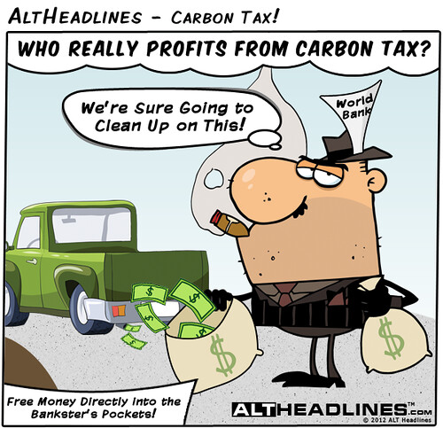

# **Favourite Academic Work**

Over the summer I took an economic course and one of the papers I wrote was on the Carbon Tax in Canada. Carbon Tax is something that I thought was easy to implement and was a no brainer for governments. After my research, I understood the challenges behind it and why it is harder to implement than I thought. This included;
+ The huge price needed to be put on carbon to make a carbon tax effective.
+ The cooperation needed from trading partners in order to not greatly hurt domestic industries.
+ and how little our government has prepared our country for a transition into having such a high price on carbon.
This was an essay topic that I went into thinking I knew a lot about but after the research I realized how wrong I was.

[Carbon Tax, It's Purpose, and How It Works](https://www.thebalance.com/carbon-tax-definition-how-it-works-4158043)
[National Carbon Tax Upheld by Canada's Supreme Court](https://www.scientificamerican.com/article/national-carbon-tax-upheld-by-canadas-supreme-court/)
